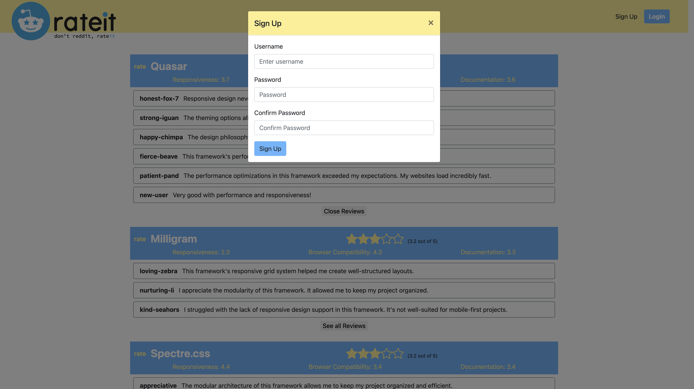
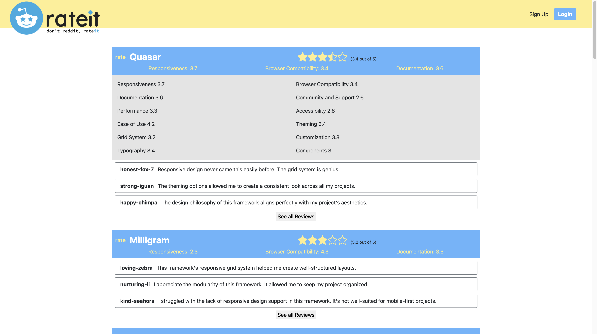
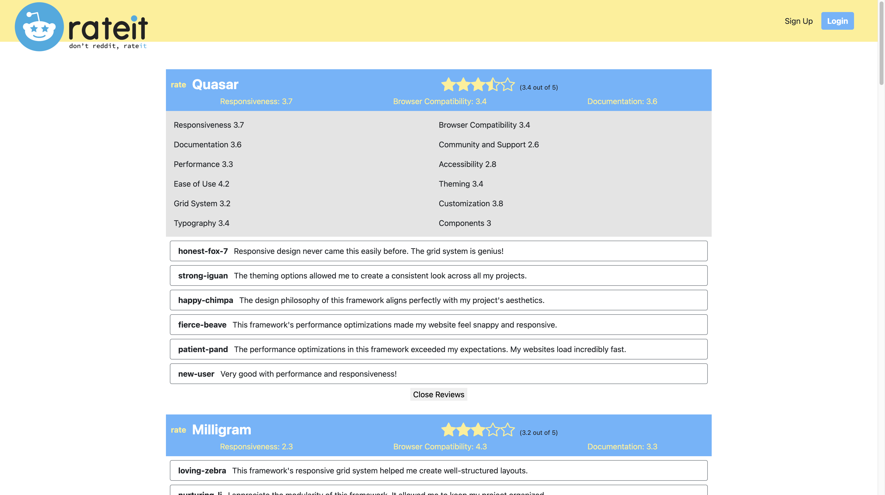
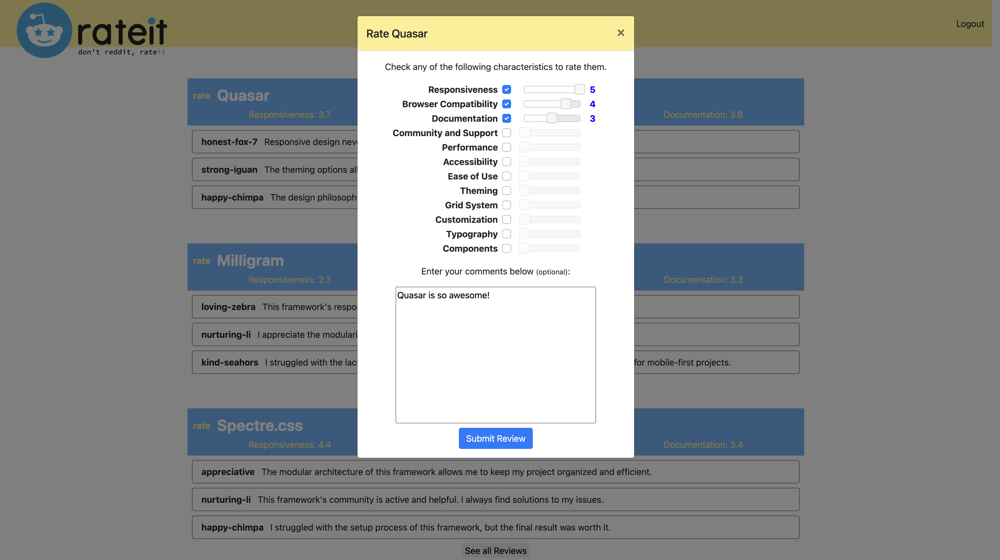

# 

## Table of Contents
- [Description](#description📝)
- [Installation](#installation💻)
- [Usage](#usage👨‍💻)
- [Features](#features🎁)
- [Credits](#credits📣)
- [Resources](#resources🛠️)
- [License](#license🔍)

## Description📝
The ultimate destination for streamlined developer tool selection!
A Reddit-inspired platform solely dedicated to rating developer tools, and designed to elevate your search for the perfect tool. 
We've revolutionized the process by condensing ratings and insights from our diverse developer community into an easy comprehensible format. 
Our user-friendly interface empowers users to effortlessly explore and rate the ever evolving developer tools. So say goodbye to wasted time and hello to well-informed decisions – with rateit, you're equipped to confidently choose the ideal tools for all of your projects.

## Installation💻
The URL will work with most browsers. The preferred Browser is Google Chrome and GitHub is where the main code for the site is stored. You can simply visit the URL below to view the repository:

[Github repository:  rateit](https://github.com/JimmyJr77/rateit)

## Usage👨‍💻
[Click here to visit:  rateit](https://rateit-e0014fad4ba9.herokuapp.com/)

### The USER may search for the ideal developer tool immediately by choosing a desired Category or SIGN UP to start reviewing their developer tools

---------------------------------------------------------------------------------------------------------------------------------------------

### After USER chooses a category, they can see all the dev tools under the selected category with overall ratings and top three community reviews

----------------------------------------------------------------------------------------------------------------------------------------------

### The USER can click on SIGN UP button to be able to Rate and comment developer tools

## Features🎁

### The USER clicks on desired TOOL and it will display all their Characteristics with reviews

----------------------------------------------------------------------------------------------------------------------------------------------

### The USER can click "See all reviews" to see ALL Community Text Reviews

----------------------------------------------------------------------------------------------------------------------------------------------
### The USER can click on the RATE button (if they are logged in after Sign Up) to rate a tool and choose with characteristics they want to rate. User is not required to rate all characteristics

## Credits📣
### Names are links that take you to developer Github profiles

[Angeling Rajan](https://github.com/angelinrajan)

[Daniel Morante](https://github.com/JMorante89)

[Edward Chang](https://github.com/ednihilator)

[Jacob Medina](https://github.com/jacob-medina)

[Jimmy O'Brien](https://github.com/JimmyJr77)

## Resources🛠️
### Web API and Frameworks Used

- [jQuery](https://code.jquery.com/jquery-3.7.0.min.js)
- [Materialize](https://materializecss.com/)
--------------------------------------------------------------------------------------------------------------------------------------------------------------------------------
### Images used

- [Original Reddit Logo svg](./public/images/reddit-logo-new.svg)
- [Rateit Logo png](./public/images/rateit.png)
- [Full star png](./public/images/full-star.png)
- [Full star png](./public/images/full-star.png)
- [Half star png](./public/images/half-star.png)
- [Empty star png](./public/images/empty-star.png)
- [Hover star png](./public/images/hover-star.png)

## License🔍

Permission is hereby granted, free of charge, to any person obtaining a copy of this software and associated documentation files (the “Software”), to deal in the Software without restriction, including without limitation the rights to use, copy, modify, merge, publish, distribute, sublicense, and/or sell copies of the Software, and to permit persons to whom the Software is furnished to do so, subject to the following conditions:

The above copyright notice and this permission notice shall be included in all copies or substantial portions of the Software.

THE SOFTWARE IS PROVIDED “AS IS”, WITHOUT WARRANTY OF ANY KIND, EXPRESS OR IMPLIED, INCLUDING BUT NOT LIMITED TO THE WARRANTIES OF MERCHANTABILITY, FITNESS FOR A PARTICULAR PURPOSE, AND NONINFRINGEMENT. IN NO EVENT SHALL THE AUTHORS OR COPYRIGHT HOLDERS BE LIABLE FOR ANY CLAIM, DAMAGES, OR OTHER LIABILITY, WHETHER IN AN ACTION OF CONTRACT, TORT, OR OTHERWISE, ARISING FROM, OUT OF, OR IN CONNECTION WITH THE SOFTWARE OR THE USE OR OTHER DEALINGS IN THE SOFTWARE.

This project is made under the [MIT License](./LICENSE).